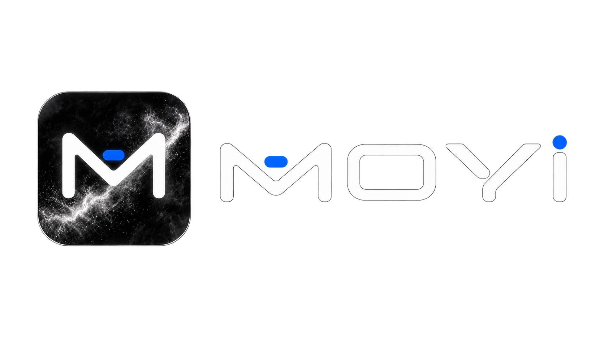
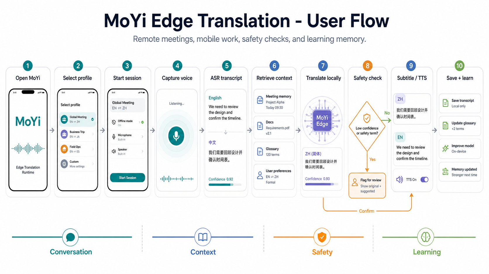
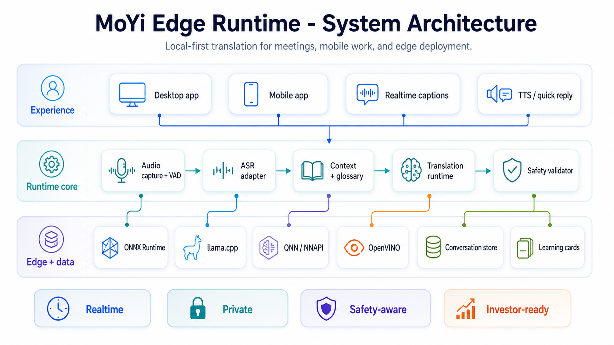
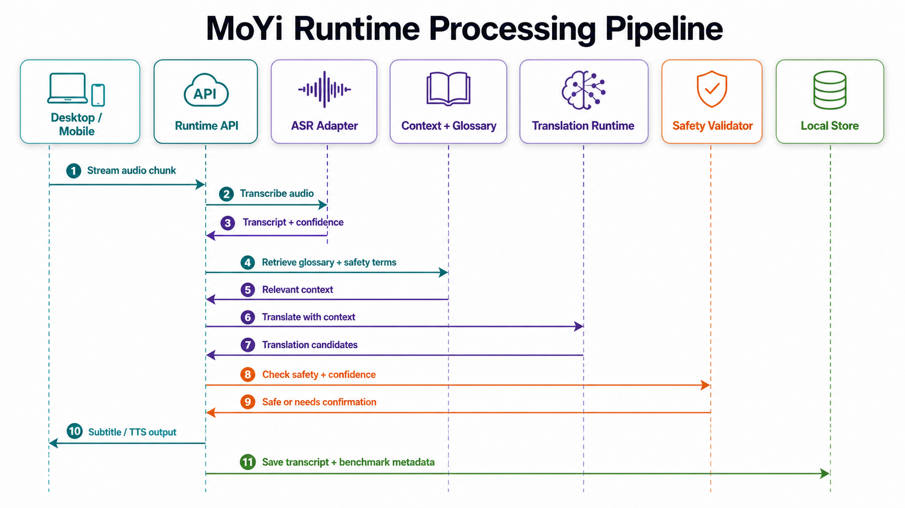
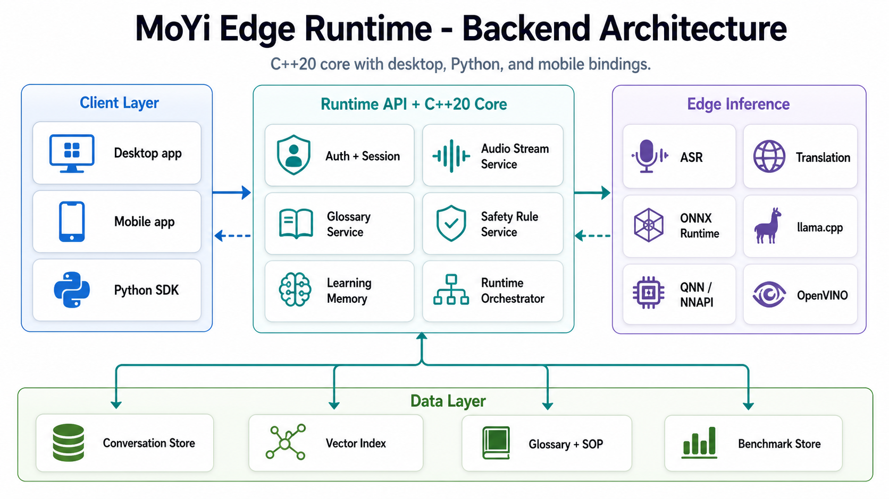
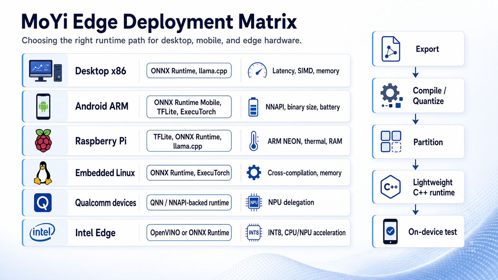
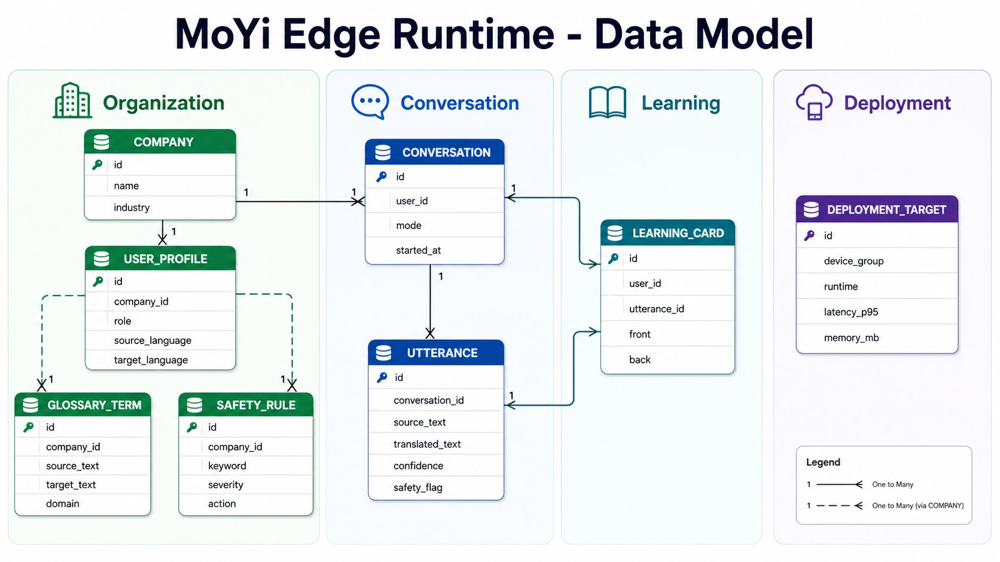

<div align="center">
  
</div>

<hr>

<div align="center" style="line-height: 1;">
  <a href="https://github.com/kyoo-147/MoYi-T2.5" target="_blank"></a>
  <a href="https://github.com/kyoo-147/MoYi-T2.5/actions/workflows/native-foundation.yml" target="_blank"></a>
  
  
</div>

<div align="center" style="line-height: 1;">
  
  
  
  
  
</div>

<p align="center">
  🏠 <b>Homepage:</b> Coming soon &nbsp;|&nbsp;
  🤗 <b>Model Hub:</b> Coming soon &nbsp;|&nbsp;
  📄 <b>Technical Report:</b> Coming soon &nbsp;|&nbsp;
  🎬 <b>Demo:</b> Coming soon &nbsp;|&nbsp;
  💬 <b>Community:</b> Coming soon
</p>

> [!NOTE]
> This public repository contains the open runtime foundation of MoYi T2.5. It does not necessarily include the newest private model experiments, competition materials, product demos, partner work, or commercial implementation details.

<div align="center">
  
</div>

## 1. Project Introduction

**MoYi T2.5** is a local-first, edge AI translation runtime for multilingual operational communication.

It is designed for environments where translation must do more than convert isolated sentences: factories, logistics operations, construction sites, hospitals, field-service teams, FDI companies, and distributed teams that need fast communication with domain terminology, safety context, and limited or restricted connectivity.

MoYi is built as a portable runtime rather than a single application. The same core is intended to support native CLI tools, Python workflows, Android clients, and future embedded or wearable deployments.

### Key Features

- **Edge-first architecture:** primary runtime boundaries are designed for local execution without requiring a cloud translation service.
- **Context-aware translation:** glossary packs, recent operational context, and domain terms can be applied before output composition.
- **Safety-first workflow:** deterministic local rules can flag critical phrases and require confirmation before an output is trusted.
- **Adapter-neutral inference:** model execution is isolated behind ASR and translation adapter contracts instead of being tied to one provider.
- **Portable native core:** C++20 orchestration is exposed through a CLI, C ABI, Python bridge, and Android JNI boundary.
- **Asset-driven configuration:** language-pair manifests, glossary packs, safety rules, and samples live outside the core engine.
- **Measurable by design:** the repository includes deterministic tests and benchmark contracts for future latency, memory, quality, and device evidence.

### User Flow

<div align="center">
  
</div>

The operational loop remains visible across the runtime design:

1. Capture a meeting, chat, or workplace utterance.
2. Detect the language pair and task context.
3. Retrieve glossary terms, SOP context, safety rules, and recent conversation context.
4. Run translation through the selected runtime adapter.
5. Validate safety-sensitive phrases.
6. Return translated output with confidence and confirmation signals.
7. Extract reusable learning memory.

## 2. Runtime Summary

<div align="center">
<table>
<tbody>
<tr>
<td align="center"><strong>Project</strong></td>
<td align="center">MoYi T2.5</td>
</tr>
<tr>
<td align="center"><strong>Project Type</strong></td>
<td align="center">Local-first multilingual edge translation runtime</td>
</tr>
<tr>
<td align="center"><strong>Public Core Version</strong></td>
<td align="center">0.1.0</td>
</tr>
<tr>
<td align="center"><strong>Core Language</strong></td>
<td align="center">C++20</td>
</tr>
<tr>
<td align="center"><strong>Public Interfaces</strong></td>
<td align="center">Native CLI, C ABI, Python SDK, Android JNI boundary</td>
</tr>
<tr>
<td align="center"><strong>Runtime Policy</strong></td>
<td align="center">Adapter-neutral, edge-first</td>
</tr>
<tr>
<td align="center"><strong>Current Runtime Adapters</strong></td>
<td align="center">Deterministic mock, ONNX Runtime boundary</td>
</tr>
<tr>
<td align="center"><strong>First Active Pair</strong></td>
<td align="center">Vietnamese → English (<code>vi-en</code>)</td>
</tr>
<tr>
<td align="center"><strong>Additional Public Asset Packs</strong></td>
<td align="center"><code>vi-zh</code>, <code>vi-ko</code></td>
</tr>
<tr>
<td align="center"><strong>Target Devices</strong></td>
<td align="center">Android phones, desktop/edge boxes, embedded or wearable development kits</td>
</tr>
<tr>
<td align="center"><strong>Public Model Weights</strong></td>
<td align="center">—</td>
</tr>
<tr>
<td align="center"><strong>License</strong></td>
<td align="center">—</td>
</tr>
</tbody>
</table>
</div>

The public repository is a runtime foundation, not a claim that production speech recognition, translation quality, or physical-device latency has already been completed.

## 3. System Architecture

<div align="center">
  
</div>

MoYi separates the product pipeline into four layers:

1. **Client surfaces** — native CLI, Python SDK, C ABI consumers, Android JNI, and future product applications.
2. **Core orchestration** — translation sessions, language-pair resolution, context retrieval, safety checks, output composition, and learning-memory extraction.
3. **Runtime adapters** — deterministic development adapters, the ONNX Runtime boundary, and future device-specific execution providers.
4. **Local assets** — model manifests, glossary packs, safety policies, and evaluation samples.

### Processing Pipeline

<div align="center">
  
</div>

```text
Audio / Text Input
        ↓
Audio Frontend or Text Entry
        ↓
ASR Adapter
        ↓
Language Pair Resolver
        ↓
Context Retriever
        ↓
Translation Adapter
        ↓
Safety Checker
        ↓
Output Composer
        ↓
Learning Memory Extractor
```

The explicit stages make it possible to test product logic with deterministic adapters today and replace model execution later without rewriting the session contract.

### Backend Runtime Boundary

<div align="center">
  
</div>

The backend keeps model execution behind adapter contracts. The public foundation can therefore exercise the pipeline with deterministic adapters while retaining a controlled path toward real local inference runtimes.

The current repository includes deterministic ASR and translation adapters for development, the ONNX Runtime adapter boundary, a C ABI bridge, a Python native mode, and an Android JNI session boundary.

### Public Component Status

| Component | Public status | Notes |
| --- | --- | --- |
| C++20 session orchestration | ✅ Implemented | Shared runtime foundation |
| Glossary and safety asset loading | ✅ Implemented | JSON asset packs |
| Deterministic ASR/translation adapters | ✅ Implemented | Development and tests only |
| C ABI and Python native mode | ✅ Implemented | Shared result contract |
| Android JNI session boundary | ✅ Implemented | Product app integration remains future work |
| ONNX model loading boundary | 🟡 Partial | Tokenizer and production tensor I/O remain |
| Real local translation model path | ⏳ Planned | Model artifacts are not included |
| Realtime microphone streaming | ⏳ Planned | Streaming state/events remain future work |
| Physical mobile performance evidence | — | Not published yet |

## 4. Evaluation Results

MoYi will publish results only when each value is tied to an exact model, asset revision, runtime, build, device, and measurement protocol. Empty values below are intentional.

<div align="center">
<table>
<thead>
<tr>
<th align="center">Category</th>
<th align="center">Metric</th>
<th align="center">MoYi T2.5</th>
<th align="center">Evidence</th>
</tr>
</thead>
<tbody>
<tr>
<td align="center" rowspan="4"><strong>Translation Quality</strong></td>
<td align="center">BLEU</td>
<td align="center">—</td>
<td align="center">—</td>
</tr>
<tr>
<td align="center">chrF++</td>
<td align="center">—</td>
<td align="center">—</td>
</tr>
<tr>
<td align="center">COMET</td>
<td align="center">—</td>
<td align="center">—</td>
</tr>
<tr>
<td align="center">Terminology / critical-token accuracy</td>
<td align="center">—</td>
<td align="center">—</td>
</tr>
<tr>
<td align="center" rowspan="3"><strong>Runtime</strong></td>
<td align="center">p50 / p95 latency</td>
<td align="center">—</td>
<td align="center">—</td>
</tr>
<tr>
<td align="center">Real-time factor</td>
<td align="center">—</td>
<td align="center">—</td>
</tr>
<tr>
<td align="center">Peak RSS / package size</td>
<td align="center">—</td>
<td align="center">—</td>
</tr>
<tr>
<td align="center" rowspan="2"><strong>Reliability</strong></td>
<td align="center">Safety-rule recall</td>
<td align="center">—</td>
<td align="center">—</td>
</tr>
<tr>
<td align="center">Long-session stability</td>
<td align="center">—</td>
<td align="center">—</td>
</tr>
<tr>
<td align="center"><strong>Deployment</strong></td>
<td align="center">Verified accelerator placement</td>
<td align="center">—</td>
<td align="center">—</td>
</tr>
</tbody>
</table>
</div>

> [!IMPORTANT]
> Deterministic mock output, successful model loading, ONNX conversion, or session creation must not be reported as real translation quality or accelerator execution evidence.

Benchmark contracts and the baseline template live under [`docs/benchmarks/`](docs/benchmarks/).

## 5. Edge Optimization

MoYi treats model quality and edge execution as separate evidence gates.

```text
Model checkpoint
      ↓
Exportable graph + tokenizer contract
      ↓
ONNX numerical and text parity
      ↓
Quantization and quality parity
      ↓
Portable CPU baseline
      ↓
Optional NNAPI / QNN / device acceleration
      ↓
Physical-device latency, memory, thermal, and stability evidence
```

### Planned Optimization Matrix

| Area | Current public path | Future evidence |
| --- | --- | --- |
| Graph format | ONNX adapter boundary | Exact export and parity report |
| Quantization | — | FP16 / INT8 quality and runtime comparison |
| Android baseline | JNI + ONNX Runtime direction | ARM64 CPU and mobile package benchmark |
| Generic acceleration | — | XNNPACK / NNAPI provider assignment |
| Qualcomm acceleration | — | QNN/HTP graph-placement evidence |
| Memory and thermal | — | Physical-device p50/p95, RSS, thermal, battery |

A successful compile or session start is not enough to claim that a graph executed on an NPU. Provider and node assignment must be measured explicitly.

## 6. Deployment

<div align="center">
  
</div>

| Device group | Runtime candidates | Evaluation focus |
| --- | --- | --- |
| Desktop x86 | ONNX Runtime, future llama.cpp path | Latency, SIMD, memory |
| Android ARM64 | ONNX Runtime Mobile, future device providers | Binary size, latency, RAM, battery |
| Raspberry Pi / ARM edge box | ONNX Runtime or lightweight native runtimes | ARM NEON, thermal, RAM |
| Embedded Linux | ONNX Runtime, future ExecuTorch path | Cross-compilation, footprint |
| Qualcomm devices | NNAPI / future QNN path | Positive NPU delegation evidence |
| Intel Edge | ONNX Runtime or future OpenVINO path | INT8 and CPU/NPU execution |

The portable baseline remains more important than any single premium-device accelerator. Device-specific paths should be promoted only after they outperform the baseline with equivalent output quality.

## 7. Usage

### Build and Test

MoYi uses CMake presets:

```powershell
cmake --preset default
cmake --build --preset default
ctest --test-dir build/default --output-on-failure
```

The native CLI target is named `moyi`.

### Native CLI

Text demo:

```powershell
build/default/moyi.exe `
  --text "Dung may lai, kiem tra cam bien an toan." `
  --pair vi-en
```

Asset-driven demo:

```powershell
build/default/moyi.exe `
  --text "Dung may lai, kiem tra cam bien an toan." `
  --pair vi-en `
  --glossary assets/glossary/factory_vi_en.json `
  --safety assets/safety/factory_rules_vi_en.json `
  --manifest assets/models/vi-en/manifest.yaml
```

Benchmark JSON mode:

```powershell
build/default/moyi.exe `
  --bench-samples assets/samples/factory_utterances_vi.txt
```

### Python SDK

```powershell
cd bindings/python
python -m moyi_edge.cli `
  --text "Dung may lai, kiem tra cam bien an toan."
```

Use the shared native C++ runtime through the C ABI bridge:

```powershell
python -m moyi_edge.cli `
  --native `
  --text "Dung may lai, kiem tra cam bien an toan."
```

If the native library is not discovered under `build/**`, set `MOYI_C_API_LIBRARY` to the compiled library path.

### Result Contract

Native and Python paths expose the same core result fields:

- `session_id`
- `language_pair`
- `source_text`
- `translated_text`
- confidence values
- safety decision
- context used
- extracted learning cards

## 8. Repository Layout

```text
core/                 C++ runtime contracts and orchestration
runtimes/mock/        Deterministic ASR/translation development adapters
runtimes/onnx/        ONNX Runtime adapter boundary
bindings/native/      C ABI bridge
bindings/python/      Python SDK and native bridge
bindings/android-jni/ Android JNI session boundary
apps/cli/             Native CLI and benchmark surface
apps/examples/        Integration examples
assets/               Logo, manifests, glossary packs, safety packs, samples
docs/                 Architecture, roadmap, and benchmark contracts
tools/                Conversion and benchmark helpers
```

### Data and Asset Model

<div align="center">
  
</div>

Operational knowledge remains external to the core where possible:

- model manifests describe language pairs and runtime expectations;
- glossary packs define company and domain terminology;
- safety packs define critical phrases and confirmation behavior;
- sample utterances support deterministic tests and benchmarks;
- learning cards can be extracted from translated operational conversations.

## 9. Roadmap

1. **Verified native foundation** — keep clean-machine build, tests, and deterministic CLI behavior stable.
2. **Asset-driven runtime** — maintain shared glossary, safety, and manifest contracts across interfaces.
3. **Measured runtime quality** — publish reproducible latency and memory reports.
4. **Real local model path** — complete tokenizer and tensor I/O for one Vietnamese-English model.
5. **Native Python integration** — keep Python on the shared C++ core.
6. **Android runtime** — execute the same translation session through JNI.
7. **Streaming audio** — add chunk queues, session states, and partial/final events.
8. **Language expansion** — validate `vi-en` first, then promote `vi-zh` and `vi-ko` with evidence.
9. **Physical edge validation** — report exact device, runtime, model, latency, RAM, thermal, and stability results.

Detailed planning:

- [`docs/NEXT_PHASE_BRIEF.md`](docs/NEXT_PHASE_BRIEF.md)
- [`docs/TECHNICAL_ROADMAP.md`](docs/TECHNICAL_ROADMAP.md)
- [`docs/architecture/`](docs/architecture/)

## 10. License

A project license has not been selected yet.

Until a license is added, the source remains publicly visible for review, but reuse and redistribution rights are not granted automatically.

## 11. Contact

- 🐙 **GitHub:** [kyoo-147/MoYi-T2.5](https://github.com/kyoo-147/MoYi-T2.5)
- 🐛 **Issues:** [Open an issue](https://github.com/kyoo-147/MoYi-T2.5/issues)
- 🌐 **Homepage:** —
- 🤗 **Model Hub:** —
- 📧 **Email:** —
- 💬 **Community:** —
